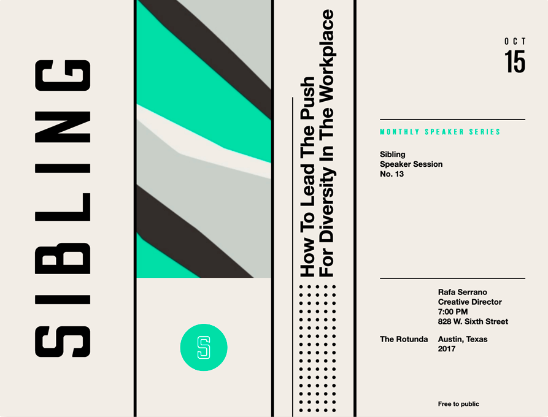

# Sibling: poster design experiment

Goofing around to solve a challenge posed to Eric Meyer in a [2018 episode of ShopTalk Show](https://shoptalkshow.com/331-think-like-front-end-developer-eric-meyer/#t=56:20) about how to build [this poster design](https://dribbble.com/shots/4858587-Sibling) by Steve Wolf as a front-end webpage.

CSS Grid doing the heavy lifting, a dash of Flexbox, sideways text using `writing-mode` and `transform`, an embedded SVG background pattern using a data URL, and a couple pseudo-elements.

Done in a single sitting so code is sloppy. Layout is desktop only for now, big whoop.

Verified consistent in Chrome, Safari, and Firefox on Mac. Surely won't work on any version of IE. Probably works on Edge.

Woo! Fun experiment.
